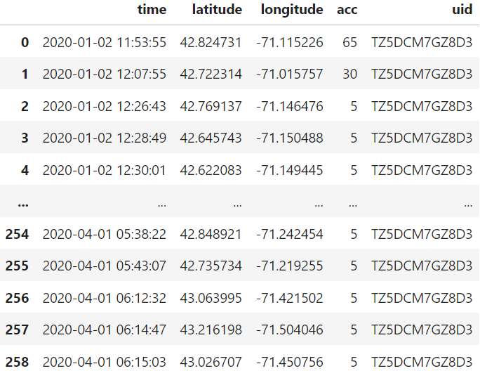
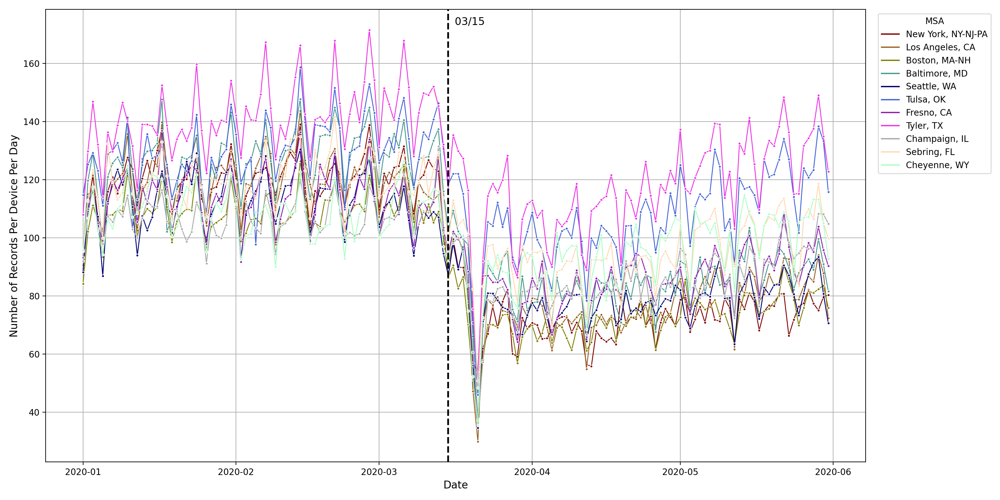
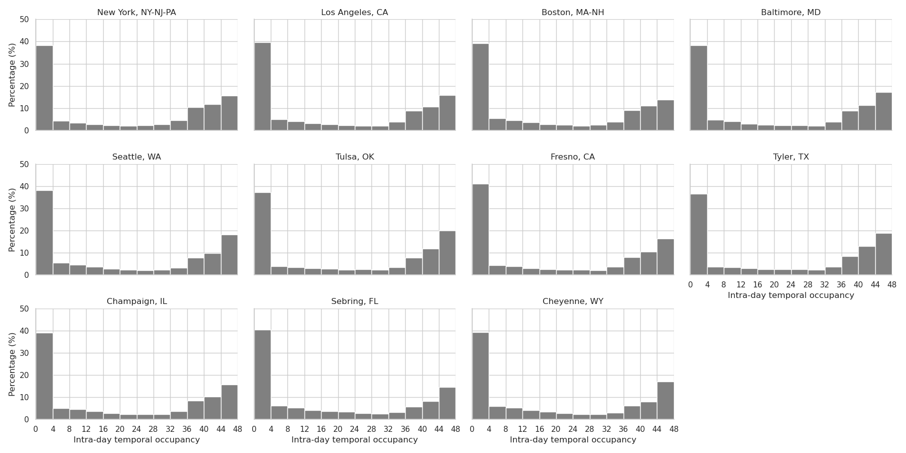
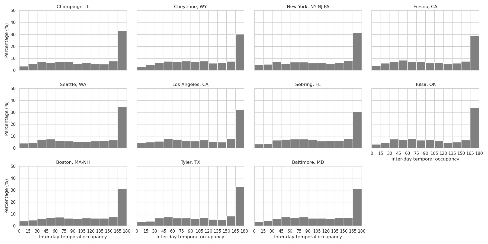
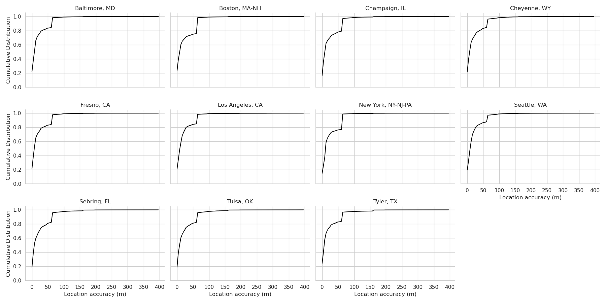
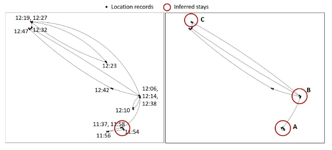
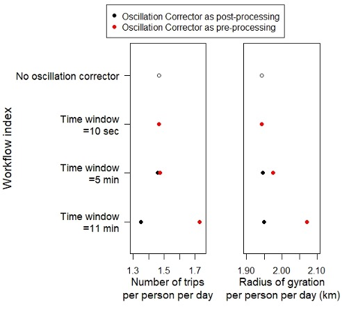
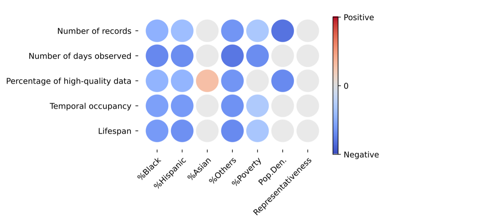
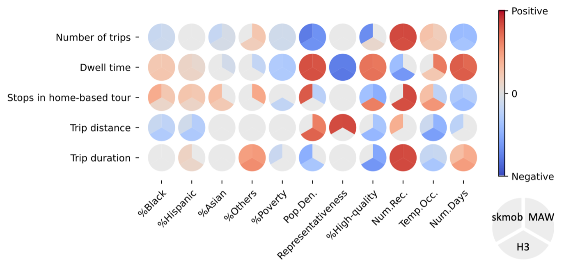
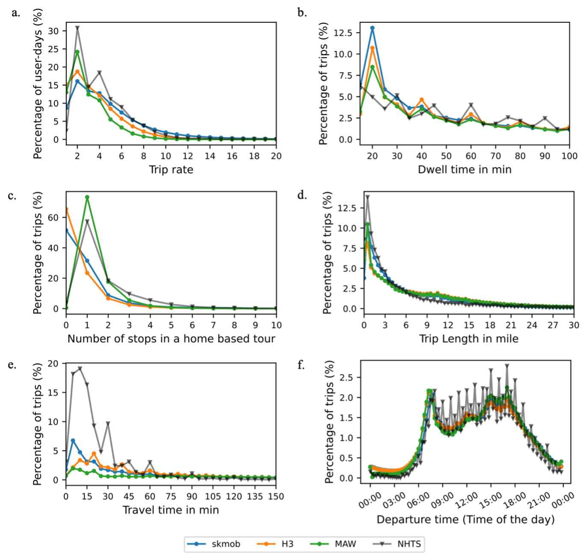

Purpose: this webpage is created to provide some summary information about LBS data, especially those that are passively generated from people's mobile devices. 
Audience: the intended audiences are practitioners who may or may not have used the LBS data, and have an interest in learning more about them. 
What you will find: I) key takeaways about LBS mobile data; II) a comparison table across different datasets; and III) key characteristics of LBS mobile data

LBS mobile data: Location-based service data that are passively generated from peoples' mobile devices such as smartphones.  
HTS: household travel surveys

## I. Key takeaways about LBS mobile data as compared to HTS

### Data generation 
1. LBS data itself does not contain any travel related information. This means that all travel related information (such as trips and stays) must be inferred. 
2. LBS data does not contain any socio-demographics information, meaning that for any datasets containing such information, they are fused in. 

### Data stability
1. Number of devices contained in a dataset often changes over time. 
2. Number of records per device also changes over time. 

### Data quality metrics
1. LBS data is big,  covering a much larger share of the population in a region than HTS or online panels. 
2. Spatially, LBS data is quite precise (e.g., close to 95% of the observations have an uncertainty radius of less than 65 meters). 
3. Temporally, LBS data is quite sparse (e.g., within a day, the vast majority are only observed a few times). 

### Data biases
1. Number of records has a positive effect on trips inferred: the more records, the more trips inferred. 
2. Temporal occupancy (defined as the number of 30-min slots in a day when a device is observed) has a positive effect on trips inferred: the more one's records are temporally covered, the more trips inferred.
3. The effects of data quality metrics on mobility metrics (e.g., trip rates) are much larger than those of socio-demographics and the built environment characteristics. 
4. Setting different parameter values (primarily duration and spatial thresholds beyond which observations are no longer classified as clustering together) in an algorithm will lead to different inference results for the same mobility metric. Even the same parameter values (but different algorithms) will lead to different inference results for the same mobility metric. 

## II. A comparison of various datasets for transportation applications

| Dimensions      | Household travel survey (HTS) | Online panels | LBS mobile data | Traffic counts | Smart card data |
| :---        |    :----   |  :--- |   :--- |  :---  | :--- |
| Generation      | active1 | active1   | passive2 | active1 | active-passive |
| Key data items  | trips made in a day by subjects | general travel behavior  | network interaction events3| number of moving objects at a location during a time interval | a tap in the transit system4 |
| Sampling method | probabilistic | non-probabilistic | non-probabilistic | non-probabilistic | non-probabilistic |
| Sampling rate | low | varied | high | varied | high |
| Richness | rich | rich | shallow | shallow | shallow |
| quality | high | varied | high precision and sparsity | varied | varied |
| Spatial coverage | small | varied | large | varied | varied |
| Temporal coverage | snapshot | snapshot | continuous | continuous | continuous |
| Capturing O-D patterns | yes | no | no | no | yes |
| Cost | high | moderate | low | low | low |
| Generalizability | high | low | varied | varied | varied |
| Pre-processing required | light | light | heavy | low | varied |
| Long-term policy analysis | good | good | poor | poor | poor |
| Short-term  policy analysis | poor | poor | good | good | good |

1 active: transportation-related data is actively collected. For example, in HTS, respondents are asked to record all trips they made during a day. In online panels, respondents are asked about their general travel behaviors, e.g., how often they go to a workplace outside their home. Traffic count data are generated by traffic counters at specific locations for data collection. \
2 passive: data itself is not related transportation behaviors; instead, it is generated as a by-product for operation and billing purposes. Transportation-related data can be inferred from such data. For example, LBS mobile data contains users' interactions with the network from each transportation related data can be inferred. \
3 A network interaction event takes place when a user interacts with an app on their mobile device. It results in a record in the LBS mobile dataset that records the location and the time of the event. \
4 Every time a user taps their smartcard on a car reader in the transit system, it results in a record that records the location and the time of the event. 

## III. Data characteristics
### Describe data

#### A snapshot of the LBS dataset (one can see that LBS datasets often have only a few columns or variables but many many rows)

## Data stability

#### Changes in the number of devices over time in 11 MSA areas (one cannot assume data is stable over time)

#### Changes in the number of records per device per day over time in 11 MSA areas (one cannot assume data is stable over time)

## Sparsity

#### Within-day temporal occupancy in 11 MSA areas (within-day occupancy is defined as the number of 30-min slots within a day that has at least one record. The vast majority has only a few 30-minute slots observed. In other words, within a single day, there is significant data sparsity.)

#### Between-day temporal occupancy in 11 MSA areas (between-day occupancy is defined as the number of days within the 6-month period that has at least one record. Over 30% of the devices are observed nearly every day. The rest are evenly distributed from 1 to 165 days.)

## Location accuracy

#### Cumulative distributions of location accuracy of observations in 11 MSA areas (location accuracy means the radius in meters a device can be confidently located. LBS data has high location accuracy: the vast majority have an accuracy less than 100 meters). 

## Effects of oscillation

#### Effect of not removing oscillation on a single trajectory (oscillation happens when GPS signals are obstructed, i.e., by tall buildings. not removing oscillation results a biased number of stays derived. In this case, two stays are missed.)

#### Effect of treating oscillation before or after pre-processing the trajectory data (treating oscillation before or after processing the LBS data for trip inference can result in different results.)

## Effects of data quality metrics and socio-demographics

#### Effect of data quality metrics and socio-demographics (areas with more underrepresented populations such as Black and Hispanic, areas with higher poverty level and areas with a higher level of population density tend to have lower LBS data quality). 

## Effects of data quality metrics, socio-demographics and algorithms

#### Effect of data quality metrics, socio-demographics, and algorithms (Different algorithms used to process the data for trip inference can lead to different mobility metrics such as number of trips. Compared to socio-demographics, data quality has a larger influence on the resulting mobility metrics.)

## Effects of algorithms

#### Effect of algorithms on mobility metrics (Different algorithms result in different mobility metric distributions.)