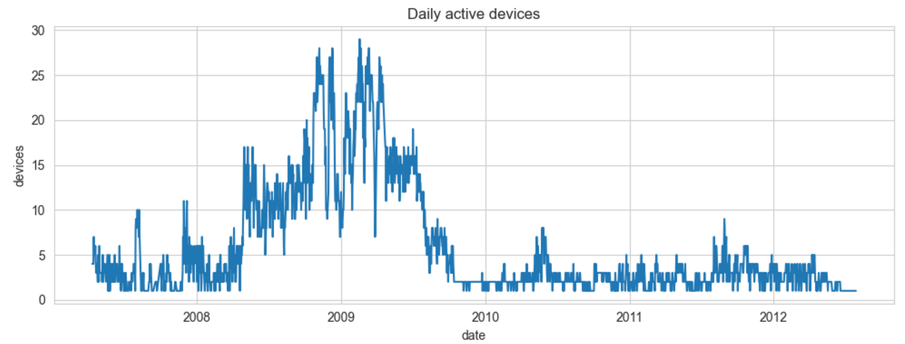
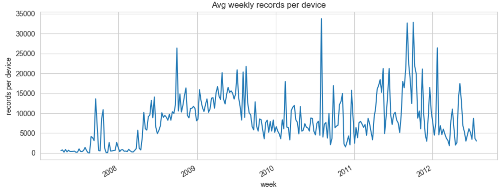
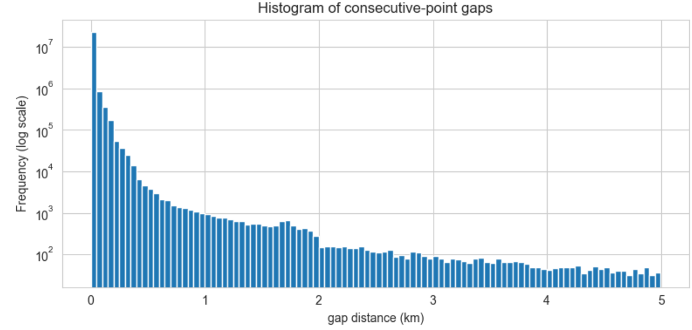
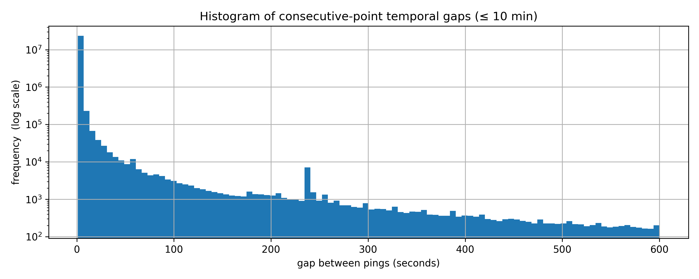

## Data Variables

### **GeoLife trajectory file** 

| # | Column name   | Type   | Unit / format                | Description |
|---|---------------|--------|------------------------------|-------------|
| 1 | `lat`         | Float  | Decimal  (WGS-84)           | Latitude |
| 2 | `lon`         | Float  | Decimal (WGS-84)           | Longitude |
| 3 | `dummy`       | Int    | — (always 0)                 | Reserved placeholder |
| 4 | `altitude_ft` | Float  | Feet (–777 = missing)        | Altitude above sea level |
| 5 | `serial_days` | Float  | Days since 1899-12-30        | Excel-style numeric datetime |
| 6 | `date`        | String | YYYY-MM-DD (GMT)             | Calendar date (string form of #5) |
| 7 | `time`        | String | HH:MM:SS (GMT)               | Time of day (string form of #5) |

### **Transportation-mode label file** (`labels.txt`)

| # | Column name  | Type     | Format                    | Description |
|---|--------------|----------|---------------------------|-------------|
| 1 | `start_time` | Datetime | YYYY/MM/DD HH:MM:SS (GMT) | Segment start |
| 2 | `end_time`   | Datetime | YYYY/MM/DD HH:MM:SS (GMT) | Segment end |
| 3 | `mode`       | String   | walk, bike, bus, car …    | User-annotated mode |

---

## Data Characteristics

### **1 Data Stability**

| Metric | Figure | Summary statistics | Statistical definition |
|--------|--------|--------------------|------------------------|
| **Daily active devices** |  | count = 1 879, mean = 5.9, median = 3, max = 29 | Daily distinct count of `user_id`, indicating the number of devices uploading trajectories each day |
| **Weekly records per device** |  | count = 2 510, mean ≈ 9 900, median ≈ 6 400, max ≈ 190 k | For each week, compute per-device point counts, then take the cross-device mean |

*Interpretation* Activity peaks in 2008–2009 (up to 29 devices/day); afterwards both device count and per-device uploads decline sharply, reflecting heterogeneity in user engagement.

---

### **2 Temporal Sparsity**

| Indicator | Summary | Statistical definition |
|-----------|---------|------------------------|
| **Intra-day occupancy** | mean = 0.207, median = 0.167 (≈ 4 h/24 h) | For each `(user, date)`, active hours ÷ 24 |
| **Inter-day occupancy** | mean = 0.013, median = 0.004 | For each user, active days ÷ total days in observation window (2007-04-01 to 2012-08-31) |

*Interpretation* Most users collect data only intermittently within a day and appear on fewer than 2 % of calendar days.

---

### **3 Spatial Sparsity**

| Indicator | Figure | Percentiles (km) | Statistical definition |
|-----------|--------|------------------|------------------------|
| **Consecutive-point gap** |  | P50 = 0.009, P90 = 0.034, P95 = 0.065, P99 = 0.180, max = 4.997 | Haversine distance between adjacent points after time-sorting each device trajectory |

*Interpretation* More than half of successive points are < 10 m apart, whereas the long tail (≤ 5 km) results from prolonged offline intervals or occasional noise.

---

### **4 Sampling Rate (temporal gap)**  
*Temporal gap – the time interval, in seconds, between consecutive pings*

| Figure | Summary statistics (seconds) | Statistical definition |
|--------|-----------------------------|------------------------|
|  | count = 24 136 350, mean = 3.62, std = 14.55, min = 1, P50 = 2, P90 = 5, P95 = 5, P99 = 16, max = 600 | For each device, sort records chronologically and measure the interval between successive timestamps; discard duplicate-second events (Δt = 0 s) and treat gaps > 10 min as trajectory breaks, thereby focusing on regular sampling behaviour |

**Method overview**  
The consecutive-ping sampling rate is characterised by computing time differences between adjacent observations on a per-device basis.  
Intervals equal to zero seconds (simultaneous duplicate records) are removed, while gaps exceeding ten minutes are considered interruptions and excluded from the analysis to obtain a representative distribution of routine acquisition intervals.

**Interpretation**  
The median sampling interval is only 2 s and 99 % of valid intervals are ≤ 16 s, confirming that GeoLife trajectories were collected at sub-minute frequency for virtually the entire dataset. The trimmed mean of 3.6 s indicates extremely fine temporal resolution, well suited for micro-mobility or mode-detection studies. The residual tail to 10 min reflects brief device suspensions but is sufficiently rare not to compromise temporal continuity.

---

### **5 Precision (stationary-spread proxy)**

| Axis | Mean (m) | Median (m) | P90 (m) | Max (m) |
|------|---------:|-----------:|--------:|--------:|
| lat  | 152 783 | 18 074 | 255 012 | 1 373 899 |
| lon  | 487 661 | 19 306 | 116 988 | 12 527 089 |

**Statistical definition**  
1. Identify “stationary segments” where successive points are ≤ 60 s apart and ≤ 1 m in distance.  
2. Pool all stationary segments for each user; compute the standard deviation of latitude and longitude, then convert degrees to metres (× 111 320).  
3. This metric captures the spatial envelope of a user’s stop locations across the entire campaign, not sensor noise per se.

**Interpretation**  
The median envelope (≈ 18 km × 19 km) matches typical intra-city mobility. Extreme values (> 1 000 km or even > 10 000 km) are attributed to a few coordinate outliers present in the raw data, in addition to genuine long-distance trips; outlier filtering is recommended for precision assessments.
