# Open Source Dataset: GeoLife

## Data Variables

### **GeoLife trajectory file**

| # | Column name   | Type   | Unit / format                | Description |
|---|---------------|--------|------------------------------|-------------|
| 1 | `lat`         | Float  | Decimal  (WGS-84)           | Latitude |
| 2 | `lon`         | Float  | Decimal (WGS-84)           | Longitude |
| 3 | `dummy`       | Int    | — (always 0)                 | Reserved placeholder |
| 4 | `altitude_ft` | Float  | Feet (–777 = missing)        | Altitude above sea level |
| 5 | `serial_days` | Float  | Days since 1899-12-30        | Excel-style numeric datetime |
| 6 | `date`        | String | YYYY-MM-DD (GMT)             | Calendar date (string form of #5) |
| 7 | `time`        | String | HH:MM:SS (GMT)               | Time of day (string form of #5) |

### **Transportation-mode label file** (`labels.txt`)

| # | Column name  | Type     | Format                    | Description |
|---|--------------|----------|---------------------------|-------------|
| 1 | `start_time` | Datetime | YYYY/MM/DD HH:MM:SS (GMT) | Segment start |
| 2 | `end_time`   | Datetime | YYYY/MM/DD HH:MM:SS (GMT) | Segment end |
| 3 | `mode`       | String   | walk, bike, bus, car …    | User-annotated mode |

'mode': 69 users have labeled their trajectories with transportation mode, such as driving, taking a bus, riding a bike or walking. The label files store the transportation mode labels for these users.

---

## Data Characteristics

### **1. Data Stability**

### 1.1 Number of devices per day over time

| Figure | Figure description |
|--------|-------------------|
| 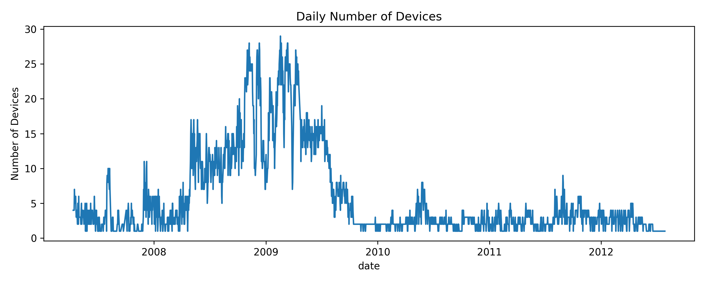 | The horizontal axis is time (date), and the vertical axis is the number of devices with records on the corresponding date. |

Summary statistics of number of device per day for different years:

| Statistic | Value&nbsp;(all&nbsp;years) | 2007 | 2008 | 2009 | 2010 | 2011 | 2012 |
|-----------|----------------------------|------|------|------|------|------|------|
| Mean | 5.93 | 3.32 | 10.54 | 11.70 | 2.43 | 2.74 | 2.21 |
| Standard deviation | 6.24 | 2.14 | 6.67 | 7.83 | 1.24 | 1.34 | 1.07 |
| Minimum | 1 | 1 | 1 | 1 | 1 | 1 | 1 |
| 25th percentile | 2 | 2 | 5 | 4 | 2 | 2 | 1 |
| Median | 3 | 3 | 10 | 12 | 2 | 3 | 2 |
| 75th percentile | 8 | 4 | 14 | 17 | 3 | 4 | 3 |
| Maximum | 29 | 11 | 28 | 29 | 8 | 9 | 5 |

The daily number of active devices ranges from 1 to 29, with an overall mean of 5.93, a median of 3, an inter-quartile range of 2 to 8, and a standard deviation of 6.24. The yearly averages fluctuate markedly: the mean is 3.32 devices in 2007, rises to 10.54 in 2008 and peaks at 11.70 in 2009, then falls to roughly 2–3 devices per day during 2010–2012, showing that this metric varies substantially over time rather than remaining stable.

### 1.2 Number of records per device per day over time

| Figure | Figure description |
|--------|--------------------|
| 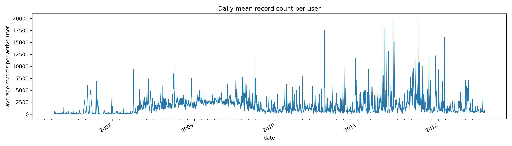 | The horizontal axis is the date, and the vertical axis is the average number of records for devices (user_ids) with records on the corresponding date |

Summary statistics of number of records per device per day (for all years):

| Statistic         |  Overall |   2007 |   2008 |   2009 |   2010 |   2011 |   2012 |
|-------------------|---------:|-------:|-------:|-------:|-------:|-------:|-------:|
| mean              |  2231.92 |  381.82 | 2126.66 | 2710.54 | 1620.70 | 2880.78 | 1490.19 |
| std               |  3443.03 | 1488.90 | 3403.61 | 3274.69 | 2290.50 | 5298.79 | 2869.91 |
| min               |     1.00 |    1.00 |    3.00 |    2.00 |    6.00 |   14.00 |   10.00 |
| 25th percentile   |   457.00 |   37.00 |  432.50 |  742.25 |  501.00 |  551.00 |  440.50 |
| median            |  1183.00 |   92.00 | 1184.50 | 1709.00 |  915.50 | 1254.50 |  692.00 |
| 75th percentile   |  2788.00 |  214.00 | 2696.25 | 3525.25 | 1711.25 | 3085.00 | 1553.50 |
| max               | 59769.00 | 20362.00 | 59769.00 | 50933.00 | 23799.00 | 56780.00 | 44808.00 |

**Findings**: From 2007 to 2012, the number of records each active device sends per day changes a lot. On average a device logs about 2 232 records, but half the devices stay below 1 183 while the busiest day reaches 59 769. The mean is only 382 in 2007 (most days fall between 37 and 214 records, standard deviation around 1 489). Activity climbs to 2 711 in 2009 and peaks at 2 881 in 2011; these two years also spread the widest, with 75 % of daily values under roughly 3 525 and standard deviations above 3 200 (topping 5 300 in 2011). In 2012 the mean drops to 1 490. The time-series plot shows the same story—many sharp spikes instead of a smooth curve—so the data load jumps day to day and year to year rather than rising or falling steadily.

---

### **2 Temporal Sparsity**

### 2.1 Intra-day Occupancy

| Figure | Figure |
|--------|--------|
| 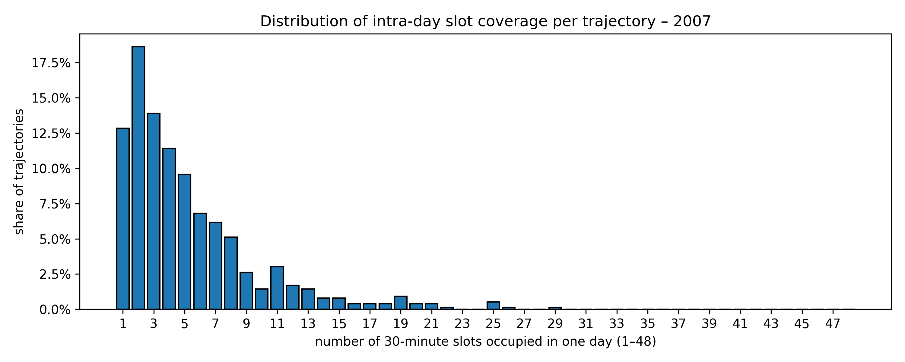 | 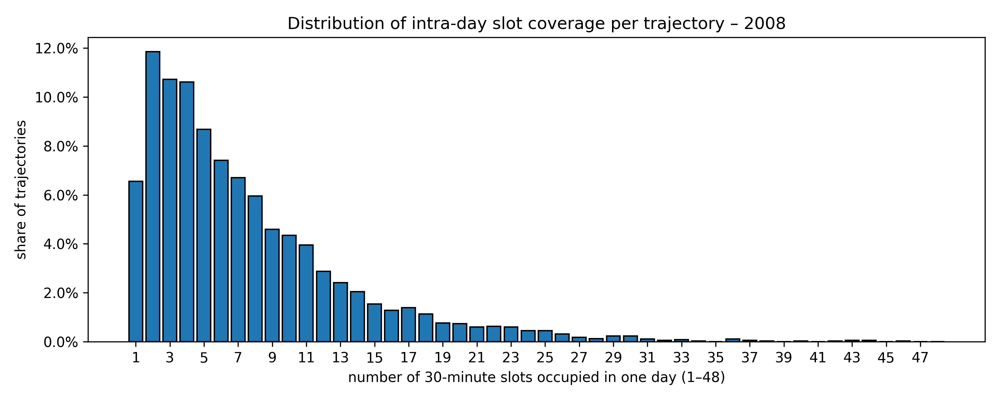 |
| 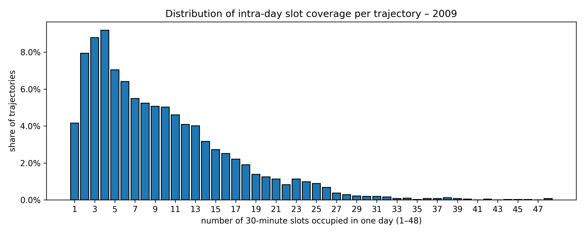 | 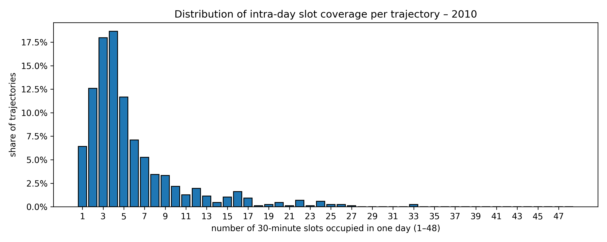 |
| 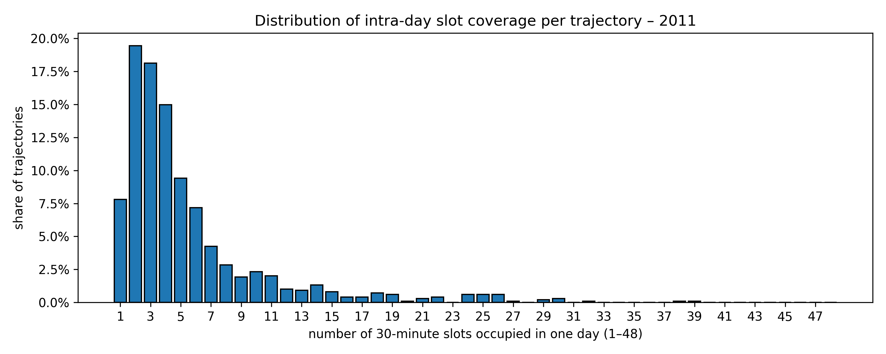 | 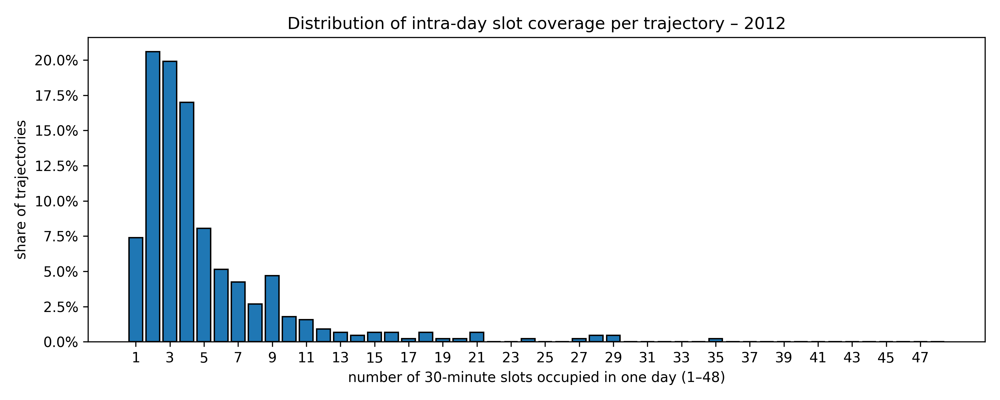 |

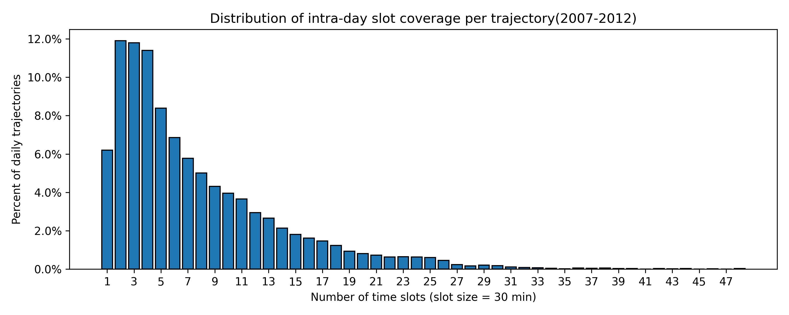

Description of the figures:
The horizontal axis is each number of 30-minute time slots in one day (there are 48 30-minute time slots in one day, ranging from 1 to 48), and the vertical axis is the percent of daily trajectories recorded in the corresponding number of time slots to the total trajectories. We plot the distribution of the intra-day occupancy for each year and whole time period (all years).

Summary statistics of Intra-day occupancy (number of time slots in one day (slot size = 30 min))

| Statistic | All years | 2007 | 2008 | 2009 | 2010 | 2011 | 2012 |
|-----------|-----------|------|------|------|------|------|------|
| Mean | 7.60 | 5.20 | 7.43 | 9.35 | 5.64 | 5.50 | 5.06 |
| Standard deviation | 6.31 | 4.41 | 6.05 | 6.94 | 4.67 | 5.31 | 4.69 |
| Minimum | 1 | 1 | 1 | 1 | 1 | 1 | 1 |
| 25th percentile | 3 | 2 | 3 | 4 | 3 | 2 | 2 |
| Median | 6 | 4 | 6 | 8 | 4 | 4 | 4 |
| 75th percentile | 10 | 7 | 10 | 13 | 7 | 6 | 6 |
| Maximum | 48 | 29 | 46 | 48 | 33 | 39 | 35 |

**Findings**: Most daily traces are short. Across all years a device is seen in about 8 of the 48 half-hour slots per day on average—roughly 4 hours—but half of the traces last 3 hours or less, and one in four lasts only 1 ½ hours. The long tail is clear: a few traces span the full 24 hours, yet most do not reach even half the day. Year-by-year, 2009 stands out with the longest coverage (mean 9.4 slots; median 8; upper quartile 13), and 2008 is next (mean 7.4; median 6). By contrast, 2007, 2010, 2011, and 2012 all hover near 5–6 slots on average, with medians of just 4. These patterns confirm that daily recording intensity varies by year and is usually modest, with only a small share of days capturing long, continuous movement.

### 2.2 Inter-day Occupancy

1. Definition?
2. The GeoLife data was collected from April 2007 to August 2012 (total 1980 days). For 2007 and 2012 it is out of a partial year for 2007 (275 days) and 2012 (244 days), and for the other years (2008-2011), it is out of full one year.

| Figure | Figure |
|--------|--------|
|  |  |
|  |  |
|  |  |

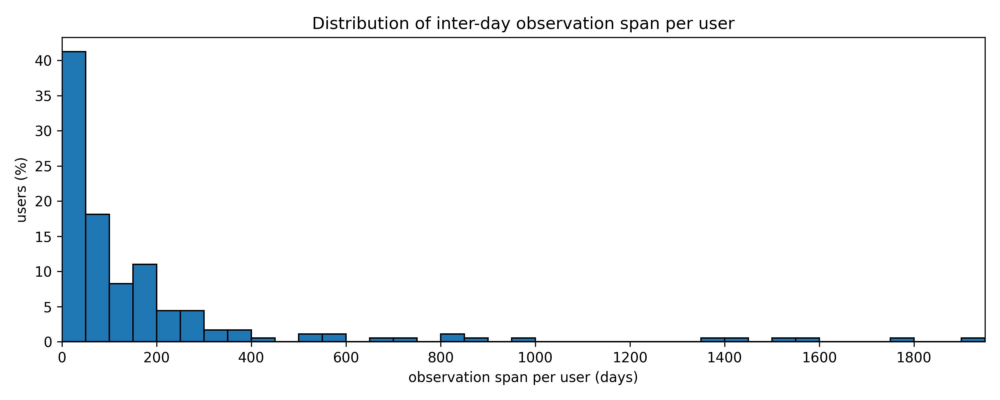

Description of the Figure:
The horizontal axis is the number of days each device (user_id) was observed during a specific time period (e.g., one year), and the vertical axis is the percent of the number of device (user_ids) with the corresponding value in number of days observed to the total number of devices (user_ids).

Summary statistics of Inter-day occupancy (number of days observed per device in one year)

| Statistic | All years | 2007 | 2008 | 2009 | 2010 | 2011 | 2012 |
|-----------|-----------|------|------|------|------|------|------|
| Total number of days| 1980 | 275 | 366 | 365 | 365 | 365 | 244 |
| Mean | 174.41 | 41.57 | 99.88 | 106.29 | 98.22 | 92.00 | 134.80 |
| Standard deviation | 318.56 | 64.25 | 91.47 | 96.83 | 124.71 | 96.56 | 62.64 |
| Minimum | 1 | 1 | 1 | 1 | 1 | 1 | 41 |
| 25th percentile | 11 | 9 | 38 | 15 | 20.25 | 12 | 120 |
| Median | 71 | 12 | 70 | 83 | 29 | 68 | 135 |
| 75th percentile | 167.50 | 32 | 123 | 165 | 132.75 | 125 | 169 |
| Maximum | 1 934 | 242 | 350 | 365 | 365 | 365 | 209 |

**Findings**: Most devices are seen only part-time. Across the whole study window (275 days), half of the user IDs appear on at most 71 days, and 75 % of them show up on fewer than 168 days. Only a small group is tracked for long stretches, but one very persistent device is present on 1 934 days. Year-by-year patterns echo this limited reach: in 2007 the average device is active just 42 days, while in 2010 and 2011 the mean hovers near 100 days. Two years stand out. In 2009 a typical device is recorded on 106 of the 365 days (about 29 % of the year). In 2012—when data run only from 1 January to 31 August (244 days)—the mean rises to 135 days, or roughly 55 % of the available period.

---

### **3 Spatial Sparsity(spatial gap)**

| Figure | Figure description |
|--------|------------------|
| 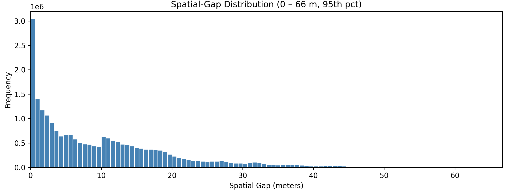 | The horizontal axis represents the distance between two adjacent records, and the vertical axis represents the number of records with the corresponding distance. The upper bound of the horizontal axis is set at the 95th percentile of the gap distribution. |

Summary statistics of spatial gaps (meters)

| Statistic | Value |
|-----------|-----------|
| Mean | 73.24063 |
| Standard deviation | 11 919.00 |
| Minimum | 0 |
| 25th percentile | 2.369673 |
| Median | 8.731946 |
| 75th percentile | 17.64321 |
| 95th percentile | 66.7 |
| 99th percentile | 190.95 |
| Maximum | 11,129,653.35 |

**Findings**: The spatial gap distribution is strongly right-skewed: the mean distance between consecutive GPS points is about 73 m, yet the standard deviation exceeds 11 km. The 25th, 50th, and 75th percentiles are roughly 2.4 m, 8.7 m, and 17.6 m, respectively, indicating that three-quarters of gaps are below 18 m. The minimum gap is 0 m, whereas the maximum exceeds 11 000 km, revealing the presence of a small number of extreme long-distance intervals within the data.

---

### **4 Sampling Rate (temporal gap)**  

| Figure | Figure discription |
|--------|-----------------------------|
|  | The horizontal axis represents the temporal gap value, and the vertical axis represents the number of records corresponding to the temporal gap value. The upper bound of the horizontal axis is set at the 95th percentile of the gap distribution.|

| Statistic | Value (seconds) |
|-----------|-----------------|
| Mean | 109.61 |
| Standard deviation | 46 652.38 |
| Minimum | 0 |
| 25th percentile | 1 |
| Median | 2 |
| 75th percentile | 5 |
| 95th percentile | 5 |
| 99th percentile| 21 |
| Maximum | 1,257,394 |

**Findings**: Most pairs of points are recorded very close in time: 50 % are within 2 s, 75 % within 5 s, and 95 % within 21 s, showing a generally high sampling rate. Only a few very long pauses—up to about 126 million s—pull the average up to 110 s and give a wide spread, so the distribution is strongly right-skewed.

---

### **5. Precision**

The spatial accuracy (radius) information is not provided in the GeoLife data, so the spatial precision of the data is unknown.

---
